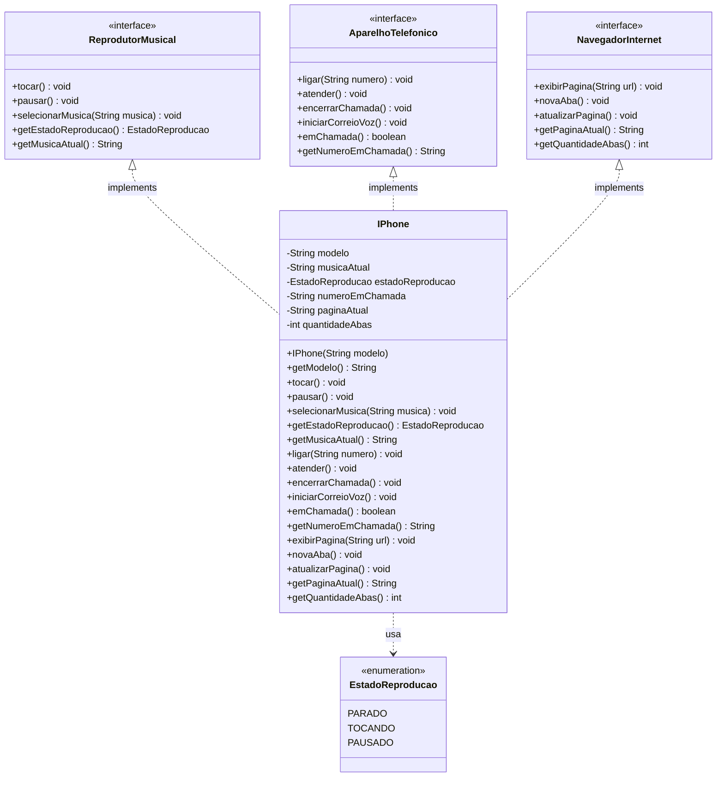

# Diagrama UML - iPhone

Diagrama de classes representando os três papéis do iPhone. Renderiza
diretamente no GitHub (suporte nativo a Mermaid).

```mermaid
classDiagram
    class EstadoReproducao {
        <<enumeration>>
        PARADO
        TOCANDO
        PAUSADO
    }

    class ReprodutorMusical {
        <<interface>>
        +tocar() void
        +pausar() void
        +selecionarMusica(String musica) void
        +getEstadoReproducao() EstadoReproducao
        +getMusicaAtual() String
    }

    class AparelhoTelefonico {
        <<interface>>
        +ligar(String numero) void
        +atender() void
        +encerrarChamada() void
        +iniciarCorreioVoz() void
        +emChamada() boolean
        +getNumeroEmChamada() String
    }

    class NavegadorInternet {
        <<interface>>
        +exibirPagina(String url) void
        +novaAba() void
        +atualizarPagina() void
        +getPaginaAtual() String
        +getQuantidadeAbas() int
    }

    class IPhone {
        -String modelo
        -String musicaAtual
        -EstadoReproducao estadoReproducao
        -String numeroEmChamada
        -String paginaAtual
        -int quantidadeAbas
        +IPhone(String modelo)
        +getModelo() String
        +tocar() void
        +pausar() void
        +selecionarMusica(String musica) void
        +getEstadoReproducao() EstadoReproducao
        +getMusicaAtual() String
        +ligar(String numero) void
        +atender() void
        +encerrarChamada() void
        +iniciarCorreioVoz() void
        +emChamada() boolean
        +getNumeroEmChamada() String
        +exibirPagina(String url) void
        +novaAba() void
        +atualizarPagina() void
        +getPaginaAtual() String
        +getQuantidadeAbas() int
    }

    ReprodutorMusical <|.. IPhone : implements
    AparelhoTelefonico <|.. IPhone : implements
    NavegadorInternet <|.. IPhone : implements
    IPhone ..> EstadoReproducao : usa
```
